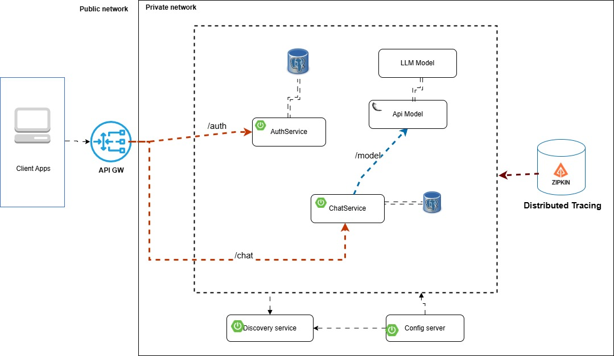
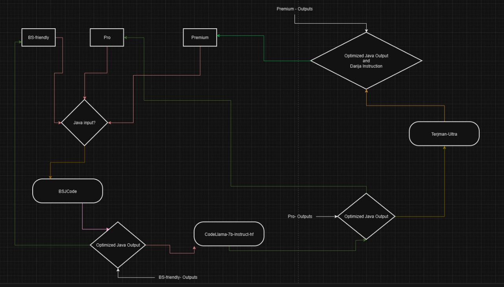
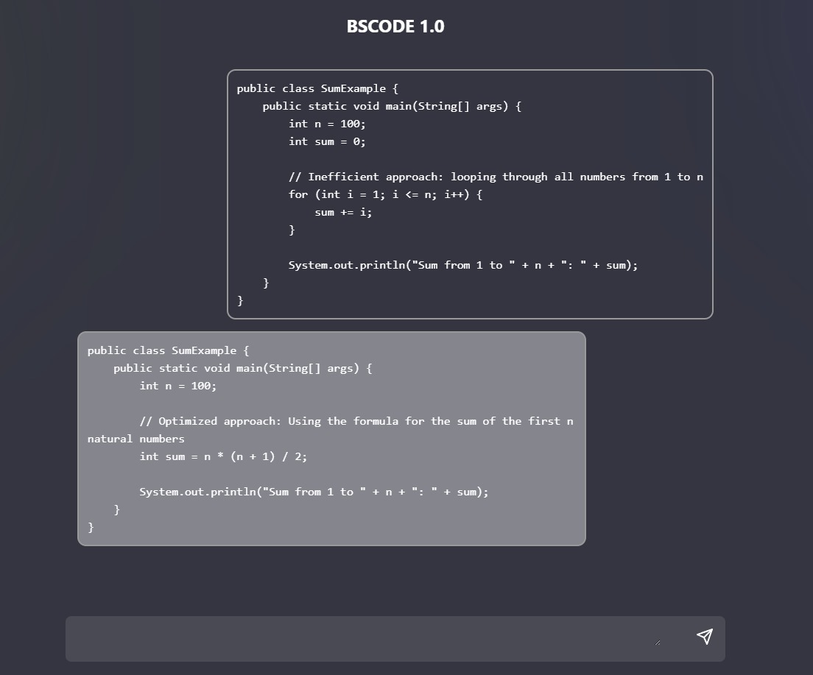

# BSCode-Optimizer

BSCode-Optimizer is an advanced AI-driven tool designed for analyzing, optimizing, and fixing code inefficiencies and bugs. It leverages state-of-the-art generative models such as **BSJCode-1-Stable**, **Code Llama**, and **Terjman-Ultra** to provide robust support for code refinement, error detection, and multilingual explanations. This tool is ideal for developers, educators, and researchers looking to streamline their workflows and enhance code quality.

---

## Features

- **Code Analysis**: Identifies inefficiencies, bugs, and potential optimizations in code.
- **Code Optimization**: Rewrites and optimizes code for better performance and readability.
- **Multilingual Support**: Explains and translates code-related instructions in Moroccan Darija, English, and other languages.
- **Customizable Pipelines**: Supports BSJCode-1-Stable for structured code optimization, Code Llama for code understanding, and Terjman-Ultra for multilingual translations.
- **Extensibility**: Easily integrate into existing workflows via APIs or Hugging Face’s Transformers library.

---

## Architecture Overview

The BSCode-Optimizer pipeline is built with multiple components to handle diverse requirements:

### BSCode-Optimizer Global Architecture



This image illustrates the high-level workflow of the BSCode-Optimizer, showing the interaction between different components and data flows.

### BSCode-Optimizer Model Architecture



This diagram provides a detailed view of the architecture, including how models like BSJCode-1-Stable, Code Llama, and Terjman-Ultra interact within the pipeline.

### BSCode-Optimizer Front-End Architecture



The front-end of BSCode-Optimizer is designed to provide an intuitive user experience, enabling seamless interaction with the API and models.

### BSCode Architecture Diagram


This diagram provides a technical overview of how different modules of BSCode-Optimizer are connected and function together.

---

## Installation

### Prerequisites
- Python 3.8+
- CUDA-enabled GPU (optional for accelerated inference)
- Hugging Face Transformers

### Install Required Libraries
```bash
pip install transformers torch accelerate flask pyngrok
```

### Clone the Repository
```bash
git clone https://github.com/your-repo/BSCode-Optimizer.git
cd BSCode-Optimizer
```

---

## Usage

### Using the Flask API
The BSCode-Optimizer includes a Flask API for seamless integration into workflows.

#### Start the Flask Server
```bash
python app.py
```

#### Example API Call
```bash
curl -X POST http://localhost:5000/predict \
-H "Content-Type: application/json" \
-d '{
    "input": "public int findMin(List<Integer> nums) { ... }",
    "service": "Pro"
}'
```

#### Response
```json
{
    "output": "Optimized and fixed code output here."
}
```

### Direct Model Interaction
You can also interact with the models directly using the following example:

#### BSJCode-1-Stable Example
```python
from transformers import AutoModelForCausalLM, AutoTokenizer

# Load the model and tokenizer
tokenizer = AutoTokenizer.from_pretrained("BSAtlas/BSJCode-1-Stable")
model = AutoModelForCausalLM.from_pretrained("BSAtlas/BSJCode-1-Stable")

# Input code snippet
code_snippet = "public int findMin(List<Integer> nums) { ... }"

# Tokenize input
tokens = tokenizer(code_snippet, return_tensors="pt")

# Generate optimized code
output = model.generate(**tokens)
optimized_code = tokenizer.decode(output[0], skip_special_tokens=True)
print(optimized_code)
```

#### Terjman-Ultra Translation
```python
from transformers import AutoTokenizer, AutoModelForSeq2SeqLM

# Load the tokenizer and model
tokenizer = AutoTokenizer.from_pretrained("atlasia/Terjman-Ultra")
model = AutoModelForSeq2SeqLM.from_pretrained("atlasia/Terjman-Ultra")

# Translate code explanation to Darija
input_text = "Explain this code snippet in Moroccan Darija."
tokens = tokenizer(input_text, return_tensors="pt")
translation = model.generate(**tokens)
output_text = tokenizer.decode(translation[0], skip_special_tokens=True)
print(output_text)
```

---

## Team and Contributors

The development of BSCode-Optimizer was a collaborative effort led by an expert team of AI researchers, software engineers, and linguists. Key contributors include:

### Core Team

- **Marouane Asmih**
- **Ahmed Elmessaoudi**
- **Habbach Oualid**
- **LamrabetChaymae**

### Technologies and Tools Used
- **Programming Languages**: Python, Java
- **Frameworks**: Flask, Hugging Face Transformers
- **Libraries**: PyTorch, BitsAndBytes
- **Hardware**: NVIDIA A100 GPUs for training and inference
- **Datasets**: Custom-curated datasets for code and multilingual tasks

---

## Model Details

### BSJCode-1-Stable
- **Purpose**: Java code optimization and error detection
- **Key Features**:
  - Identifies bugs
  - Provides optimized solutions with O-complexity analysis
- **Training Dataset**: Java-focused dataset with curated examples
- **Inference Time**: <200ms per code snippet on A100 GPU

### Code Llama (7B-Instruct)
- **Purpose**: General-purpose code synthesis and understanding
- **Capabilities**:
  - Code completion
  - Infilling
  - Instruction following
- **Training Period**: January 2023 – July 2023

### Terjman-Ultra
- **Purpose**: Multilingual code explanations and translations
- **Capabilities**:
  - Transliteration from Moroccan Darija (Arabizi)
  - Accurate Arabic-English translations
- **Performance**:
  - Loss: 2.7070
  - BLEU: 4.6998
  - Gen Len: 35.6088 tokens

---

## Training and Fine-Tuning

### BSJCode-1-Stable
- **Dataset**: Java-specific curated dataset
- **GPU**: NVIDIA A100-40GB
- **Training Time**: 32 hours

### Terjman-Ultra
- **Base Model**: `facebook/nllb-200-1.3B`
- **Dataset**: darija_english dataset with curated corpora
- **Hyperparameters**:
  - Learning Rate: `3e-05`
  - Epochs: `25`
  - Batch Size: `16`

---

## Limitations

- **BSJCode-1-Stable**:
  - May not handle non-Java languages effectively.
- **Code Llama**:
  - Accuracy can vary for large, complex codebases.
- **Terjman-Ultra**:
  - Limited by the quality of tokenizer for transliterations.

---

## Ethical Considerations

- **Unpredictable Outputs**: As with all LLMs, outputs may contain inaccuracies or undesirable content.
- **Responsible Use**: Follow Meta’s [Responsible Use Guide](https://ai.meta.com/llama/responsible-use-guide).
- **Privacy**: Avoid using sensitive or proprietary code as input.

---

## License

- **BSJCode-1-Stable**: Custom commercial license
- **Code Llama**: Meta’s custom commercial license
- **Terjman-Ultra**: Available under Hugging Face model card terms

---

## Feedback and Contributions

We welcome contributions, feedback, and suggestions to improve BSCode-Optimizer. Please open an issue or submit a pull request on the GitHub repository.

---

## Acknowledgments

This project utilizes advanced language models and training techniques from the following:

- Meta’s **Code Llama**
- **BSJCode-1-Stable** by BSAtlas
- **Terjman-Ultra** for multilingual capabilities

Special thanks to the global developer community and contributors who provided invaluable feedback and support during development.
